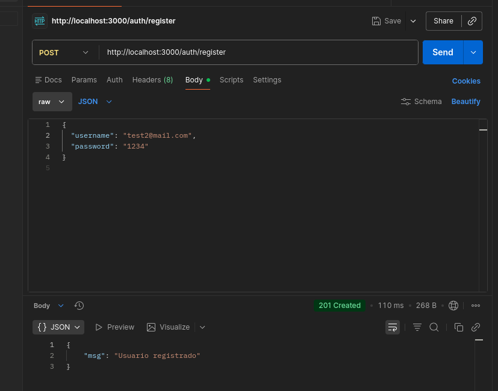
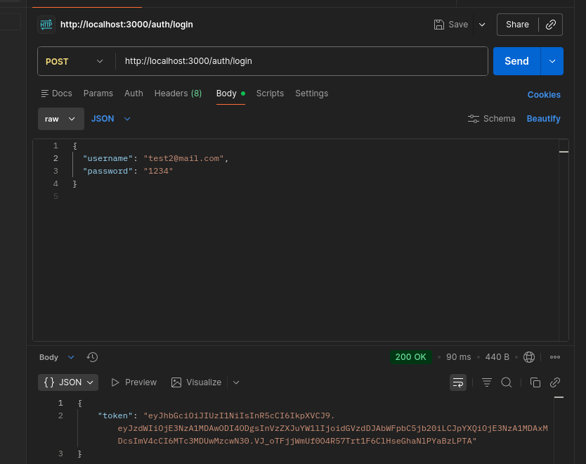
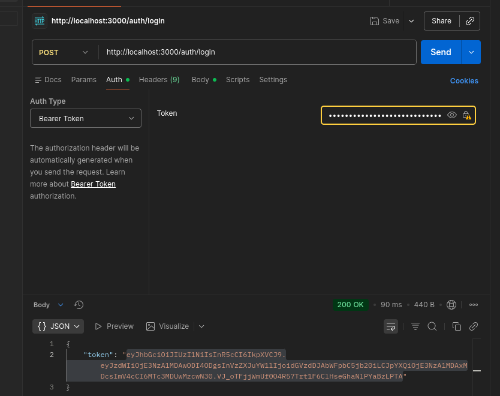
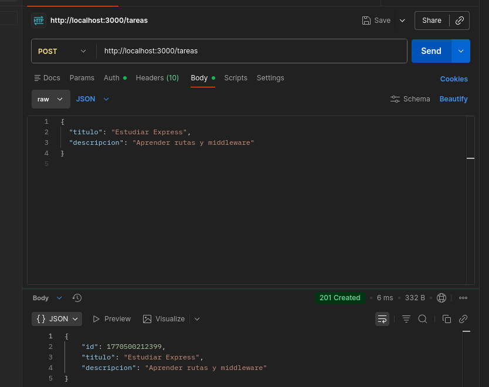
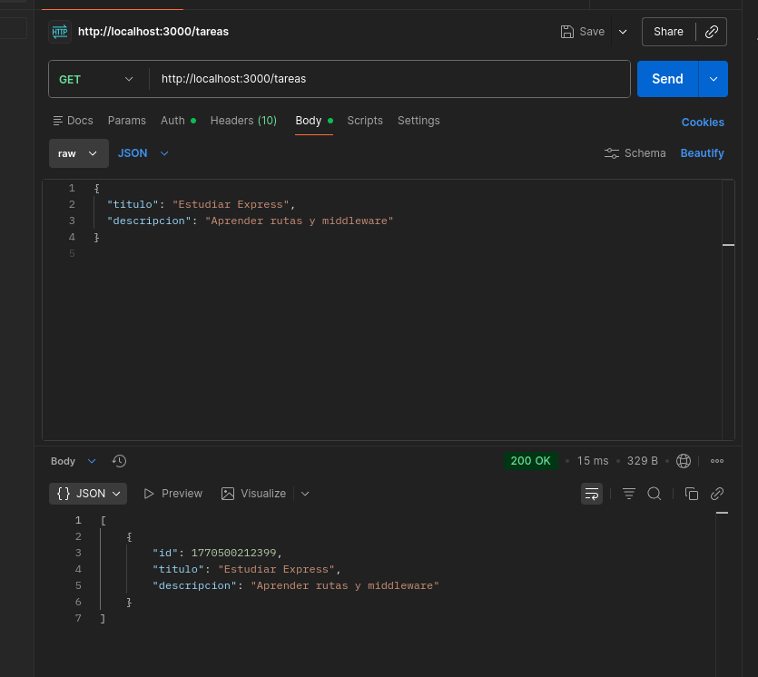
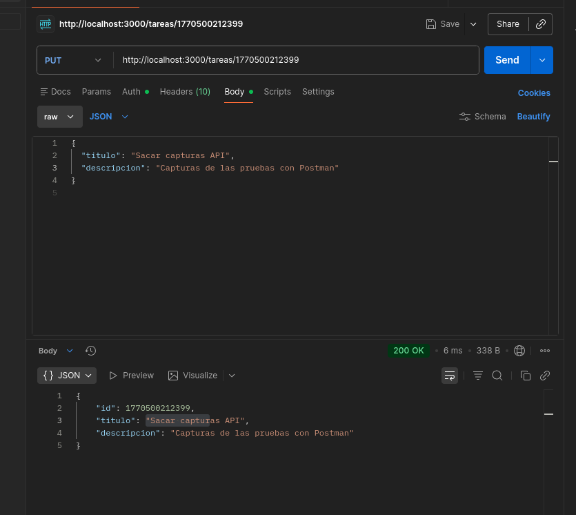
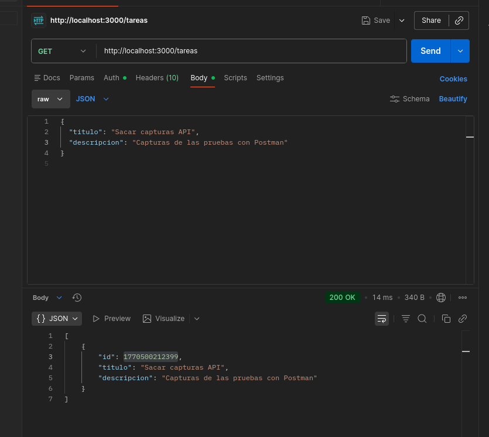
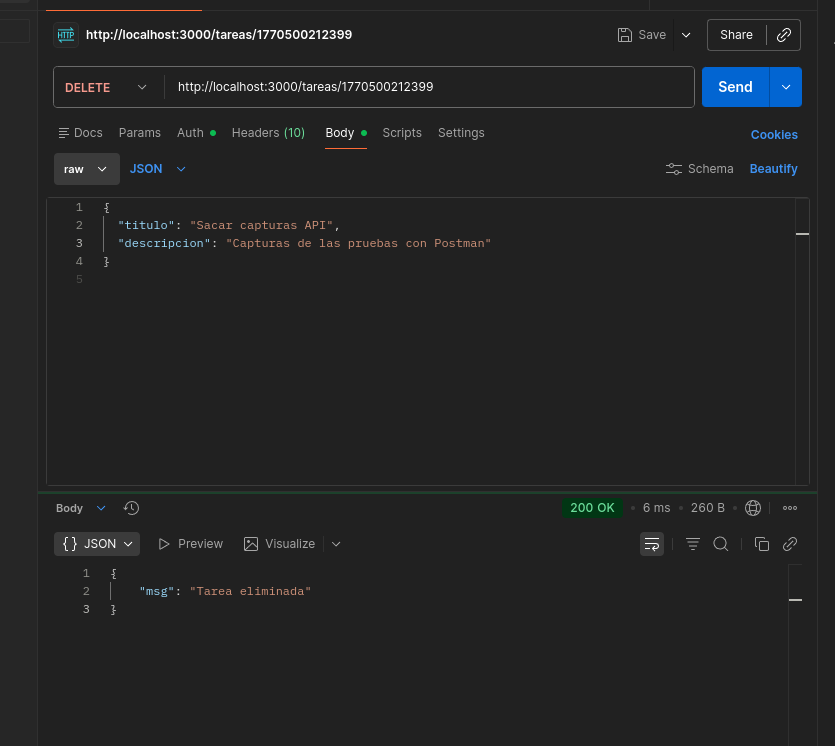
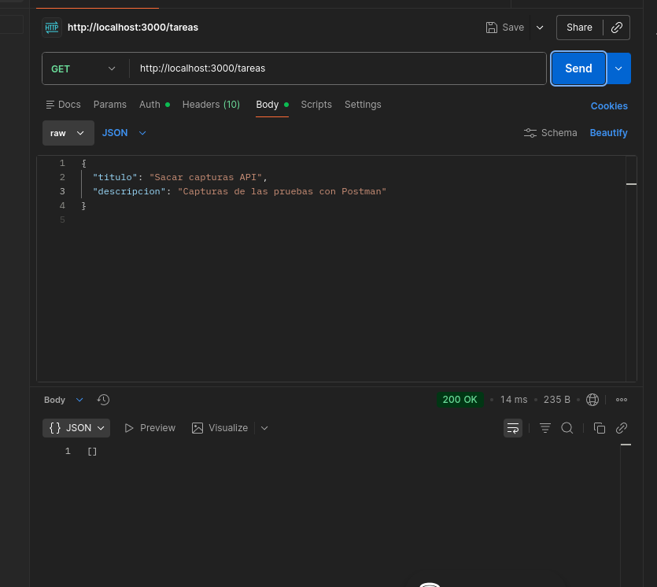

# API de Tareas con Autenticación (JWT)

API REST hecha con **Node.js + Express** para gestionar tareas (CRUD) y un módulo de autenticación con **JWT** (registro y login).

> Código principal en [`api-tareas/server.js`](api-tareas/server.js:1).

---

## Características

- Registro de usuarios con contraseña hasheada (bcrypt).
- Login y emisión de token JWT.
- CRUD de tareas (crear, listar, actualizar, eliminar).
- Persistencia simple en archivos JSON.

---

## Tech Stack

- Node.js
- Express
- JWT: `jsonwebtoken`
- Hashing: `bcryptjs`
- Variables de entorno: `dotenv`

Scripts disponibles (ver [`api-tareas/package.json`](api-tareas/package.json:1)):

- `npm run dev` (nodemon)
- `npm start`

---

## Estructura del proyecto

Carpeta principal de la API: [`api-tareas/`](api-tareas/package.json:1)

Rutas:

- Auth: [`api-tareas/src/routes/auth.routes.js`](api-tareas/src/routes/auth.routes.js:1)
- Tareas: [`api-tareas/src/routes/tareas.routes.js`](api-tareas/src/routes/tareas.routes.js:1)

Persistencia en JSON:

- Usuarios: [`api-tareas/src/data/usuarios.json`](api-tareas/src/data/usuarios.json:1)
- Tareas: [`api-tareas/src/data/tareas.json`](api-tareas/src/data/tareas.json:1)

Utils (lectura/escritura de archivos):

- [`api-tareas/src/utils/users.utils.js`](api-tareas/src/utils/users.utils.js:1)
- [`api-tareas/src/utils/tareas.utils.js`](api-tareas/src/utils/tareas.utils.js:1)

Middleware JWT (listo para usarse en rutas protegidas):

- [`api-tareas/src/middleware/auth.js`](api-tareas/src/middleware/auth.js:1)

---

## Requisitos

- Node.js (recomendado: 18+)
- npm

---

## Instalación y ejecución

1) Instalar dependencias

```bash
cd api-tareas
npm install
```

2) Configurar variables de entorno

Este proyecto usa un archivo `.env` (ejemplo en [`.env`](.env:1)):

```env
PORT=3000
JWT_SECRET=mi_clave_super_secreta_para_jwt
```

3) Iniciar en modo desarrollo

```bash
cd api-tareas
npm run dev
```

o en modo normal:

```bash
cd api-tareas
npm start
```

Servidor por defecto:

- `http://localhost:3000`

Endpoint de prueba (health check) definido en [`api-tareas/server.js`](api-tareas/server.js:25):

- `GET /` → `{ "message": "API Tareas Funciona" }`

---

## Endpoints

Base URL: `http://localhost:3000`

### Auth

Implementación en [`api-tareas/src/routes/auth.routes.js`](api-tareas/src/routes/auth.routes.js:1).

#### Registrar usuario

- `POST /auth/register`

Body:

```json
{ "username": "emi", "password": "123456" }
```

Respuestas comunes:

- `201` → `{ "msg": "Usuario registrado" }`
- `400` → `{ "msg": "username y password son requeridos" }`
- `409` → `{ "msg": "Usuario ya existe" }`

#### Login

- `POST /auth/login`

Body:

```json
{ "username": "emi", "password": "123456" }
```

Respuestas comunes:

- `200` → `{ "token": "<JWT>" }`
- `400` → `{ "msg": "username y password son requeridos" }`
- `401` → `{ "msg": "Credenciales inválidas" }`

---

### Tareas (CRUD)

Implementación en [`api-tareas/src/routes/tareas.routes.js`](api-tareas/src/routes/tareas.routes.js:1).

#### Listar tareas

- `GET /tareas`

Respuesta:

```json
[
  { "id": 123, "titulo": "...", "descripcion": "..." }
]
```

#### Crear tarea

- `POST /tareas`

Body:

```json
{ "titulo": "Estudiar", "descripcion": "Repasar Express" }
```

Respuestas comunes:

- `201` → tarea creada
- `400` → `{ "msg": "Faltan datos" }`

#### Actualizar tarea

- `PUT /tareas/:id`

Body (parcial permitido):

```json
{ "titulo": "Nuevo título", "descripcion": "Nueva descripción" }
```

Respuestas comunes:

- `200` → tarea actualizada
- `404` → `{ "msg": "Tarea no encontrada" }`

#### Eliminar tarea

- `DELETE /tareas/:id`

Respuestas comunes:

- `200` → `{ "msg": "Tarea eliminada" }`
- `404` → `{ "msg": "Tarea no encontrada" }`

---

## Ejemplos con curl

### Registrar

```bash
curl -X POST http://localhost:3000/auth/register \
  -H 'Content-Type: application/json' \
  -d '{"username":"emi","password":"123456"}'
```

### Login

```bash
curl -X POST http://localhost:3000/auth/login \
  -H 'Content-Type: application/json' \
  -d '{"username":"emi","password":"123456"}'
```

### Crear tarea

```bash
curl -X POST http://localhost:3000/tareas \
  -H 'Content-Type: application/json' \
  -d '{"titulo":"Estudiar","descripcion":"Repasar Express"}'
```

---

## Notas

- La persistencia se hace mediante archivos JSON (ver [`api-tareas/src/utils/tareas.utils.js`](api-tareas/src/utils/tareas.utils.js:1) y [`api-tareas/src/utils/users.utils.js`](api-tareas/src/utils/users.utils.js:1)).
- Existe un middleware JWT en [`api-tareas/src/middleware/auth.js`](api-tareas/src/middleware/auth.js:1) que valida `Authorization: Bearer <token>` y puede aplicarse para proteger rutas.

---

## Capturas de Funcionamiento

A continuación se muestran las capturas del funcionamiento de la API utilizando Thunder Client.

---

### 1. Registro de Usuario (POST /auth/register)

Se realiza una petición `POST` al endpoint `/auth/register` enviando en el body un JSON con `username` y `password`. El servidor responde con un código `201 Created` y el mensaje `"Usuario registrado"`, confirmando que el usuario fue creado exitosamente y su contraseña hasheada almacenada en el archivo JSON.



---

### 2. Login de Usuario (POST /auth/login)

Se realiza una petición `POST` al endpoint `/auth/login` con las credenciales del usuario registrado. El servidor valida las credenciales contra el hash almacenado y responde con un código `200 OK` junto con un token JWT que será utilizado para autenticar futuras peticiones a rutas protegidas.



---

### 3. Configuración del Token Bearer

Después de obtener el token JWT del login, se configura en la pestaña "Auth" de Thunder Client seleccionando "Bearer Token" como tipo de autenticación. Este token se incluirá automáticamente en el header `Authorization` de las peticiones subsecuentes para acceder a rutas protegidas.



---

### 4. Crear Tarea (POST /tareas)

Se realiza una petición `POST` al endpoint `/tareas` enviando un JSON con `titulo` y `descripcion`. El servidor crea la tarea asignándole un `id` único (timestamp) y responde con un código `201 Created` devolviendo el objeto de la tarea recién creada con todos sus campos.



---

### 5. Obtener Tareas (GET /tareas)

Se realiza una petición `GET` al endpoint `/tareas` para listar todas las tareas almacenadas. El servidor responde con un código `200 OK` y un array JSON conteniendo todas las tareas existentes, cada una con su `id`, `titulo` y `descripcion`.



---

### 6. Modificar Tarea (PUT /tareas/:id)

Se realiza una petición `PUT` al endpoint `/tareas/:id` (donde `:id` es el identificador de la tarea) enviando los campos a actualizar. El servidor busca la tarea por su ID, actualiza los campos proporcionados y responde con un código `200 OK` devolviendo la tarea con los datos modificados.



---

### 7. Verificar Tarea Modificada (GET /tareas)

Se realiza una petición `GET` al endpoint `/tareas` para confirmar que la modificación se aplicó correctamente. El servidor responde con el listado actualizado de tareas donde se puede observar que los campos `titulo` y `descripcion` de la tarea fueron actualizados exitosamente.



---

### 8. Eliminar Tarea (DELETE /tareas/:id)

Se realiza una petición `DELETE` al endpoint `/tareas/:id` para eliminar una tarea específica. El servidor localiza la tarea por su ID, la elimina del archivo JSON y responde con un código `200 OK` junto con el mensaje `"Tarea eliminada"` confirmando la operación.



---

### 9. Verificar Tarea Eliminada (GET /tareas)

Se realiza una petición `GET` al endpoint `/tareas` para confirmar que la tarea fue eliminada correctamente. El servidor responde con un array vacío `[]`, indicando que no existen tareas almacenadas y confirmando que la eliminación fue exitosa.


